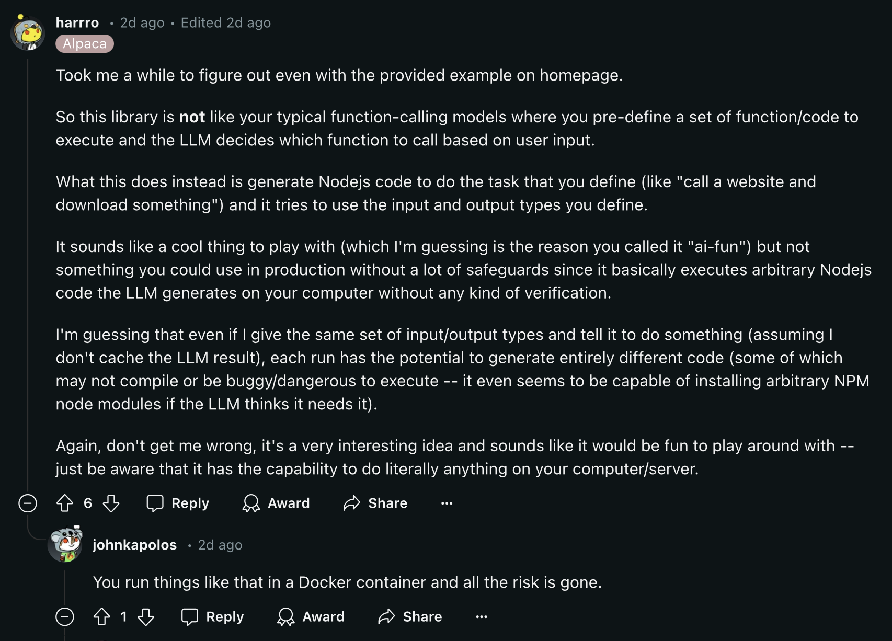

# ai-fun

ai-fun is an experimental LLM-powered function library. It lets you define the function purpose, the parameters and the output schema and generates and executes the code for you in the background. Think Cursor/GitHub Copilot but as a pluggable library.

```
npm i ai-fun
```

Complete example:

`example.ts`

```ts
import { z } from 'zod'
import AIFunctionBuilder from 'ai-fun'
import NodeExec from 'ai-fun/src/backends/node'
import { anthropic } from '@ai-sdk/anthropic'

// Provide a LLM model
const llm = anthropic.chat('claude-3-5-sonnet-20240620')

// Create a new AI Function Builder using Node/exec backend
const backend = new NodeExec()
const ai = new AIFunctionBuilder(llm, backend)

// Define the input parameters and output parameters of the function
const parameters = z.object({ a: z.number(), b: z.number() })
const output = z.number()

// Generate the function
const f = await ai.function('add values provided', parameters, output)

// Call the function and log the result
const result = await f({ a: 1, b: 2 })
console.log(result)
```

Output:

```sh
> bun example.ts
3
```

More examples found under [examples/](examples/)

### DANGER ZONE

Read this Reddit comment before you continue:



## Caching

Function caching is enabled by default for cost-saving measures. By default, the functions are stored in a file named `.ai-fun.json`.

Options you can provide to `AIFunctionBuilder`:

```ts
{
  debug?: boolean
  esModules?: boolean
  cache?: boolean
  cacheFile?: string
}
```

## Backends

You can create your own backends by implementing the `AIFunctionBackend` class:

```ts
export abstract class AIFunctionBackend {
  abstract init(codeContent: CodeContent): Promise<void>
  abstract exec(params: any): Promise<any>
}
```

See [src/backends/node](src/backends/node) for example.

### Node (exec) backend

Executes the AI-generated functions using `node:vm` exec function.

Options:

```ts
{
  debug?: boolean
  packageFile?: string
  installPackages?: boolean
}
```

## Contribute

As an open-source project, we welcome contributions from the community. If you are experiencing any bugs or want to add some improvements, please feel free to open an issue or pull request.
